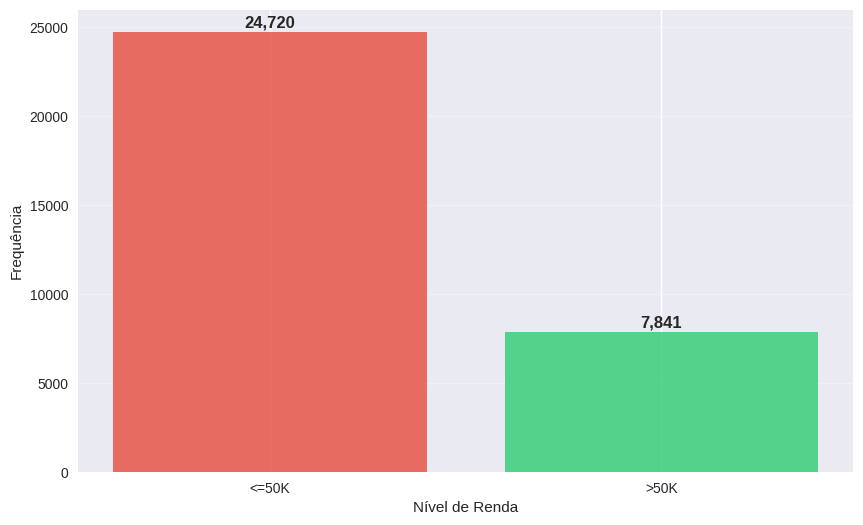
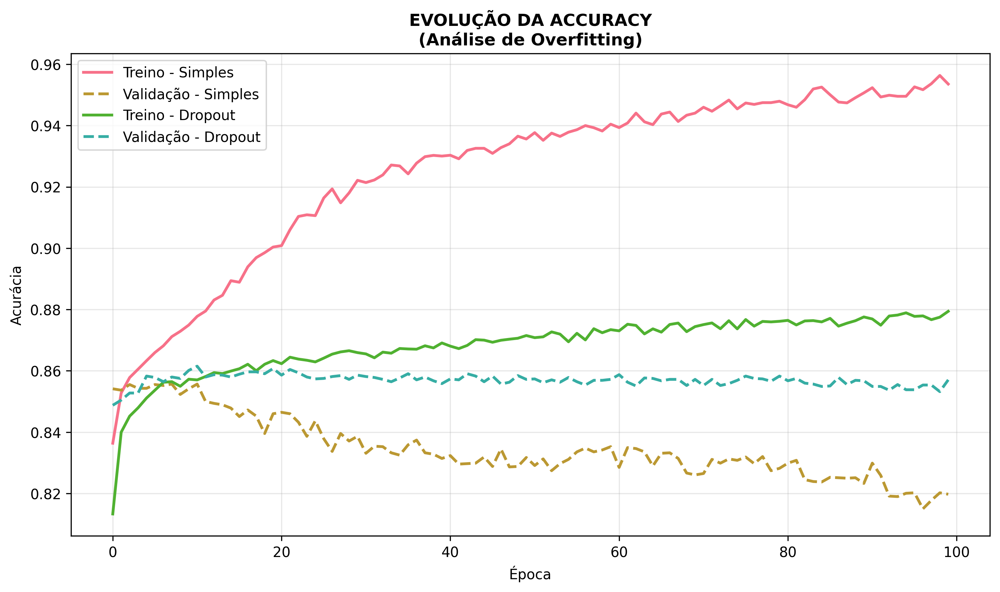
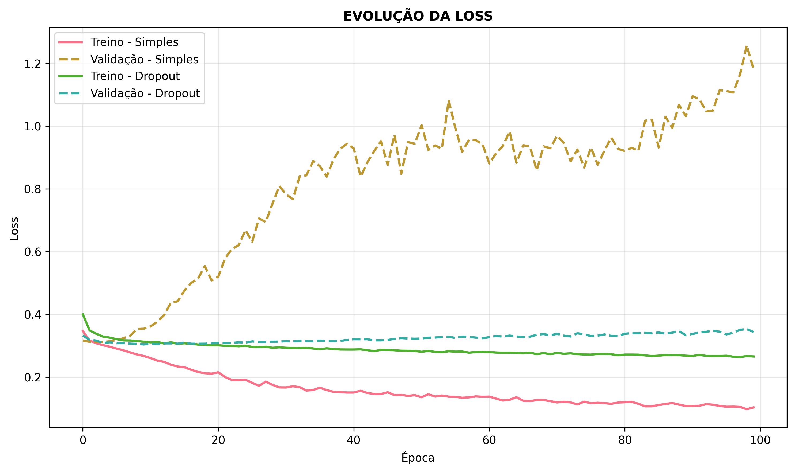
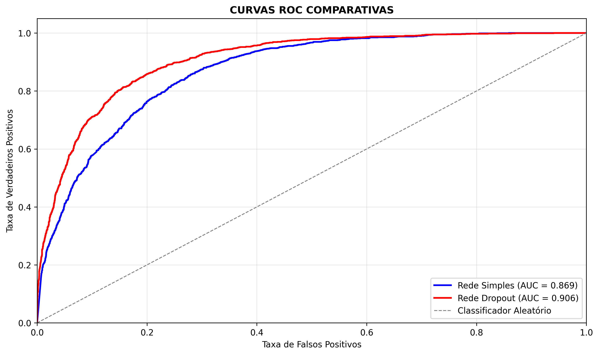

# Universidade Federal de Pernambuco

\vspace{-.4cm}

# Centro de Ciências Exatas e da Natureza

\vspace{-.4cm}

# Departamento de Estatística

\vspace{.5cm}

```{r, eval=TRUE, echo=FALSE}
data <- format(Sys.Date(), "%d de %B de %Y")
```

## TÓPICOS ESPECIAIS EM ESTATÍSTICA COMPUTACIONAL

\vspace{.5cm}
### Titulo: Predição de Níveis de Renda usando Redes Neurais: Análise Comparativa de Técnicas de Regularização
\vspace{.5cm}
## María José García Montes
**Data:** `r data`

\vspace{.5cm}

# Abstract

Este estudo investiga a eficácia de redes neurais totalmente conectadas na predição de níveis de renda com base em características demográficas e laborais. Utilizando o Adult Census Dataset ($32.561$ observações), foram implementadas e comparadas duas arquiteturas: uma rede neural simples e outra incorporando técnicas de dropout para regularização. Os resultados demonstram que a arquitetura com dropout alcançou desempenho superior em termos de generalização, reduzindo significativamente o overfitting em $11.14%$ e obtendo $85.71%$ de acurácia nos dados de teste, em comparação com $81.97%$ do modelo simples. 

Palavras-chave: Redes Neurais, Dropout, Modelo Simple

# Introdução

A predição de níveis de renda baseada em características individuais constitui um problema relevante tanto no âmbito acadêmico quanto aplicado. Modelos precisos podem auxiliar em políticas públicas, segmentação de mercado e estudos socioeconômicos. Tradicionalmente, técnicas estatísticas como regressão logística têm sido empregadas para esta finalidade, porém redes neurais artificiais emergem como alternativas promissoras devido à sua capacidade de capturar relações não-lineares complexas.

O desafio central no emprego de redes neurais reside na tendência ao overfitting, especialmente em conjuntos de dados com dimensionalidade elevada e relações complexas entre variáveis. A técnica de dropout, introduzida por Srivastava et al. (2014), surge como uma solução elegante e eficaz para este problema, promovendo a aprendizagem de representações mais robustas através da desativação aleatória de neurônios durante o treinamento.

Este trabalho tem como objetivo principal comparar o desempenho de redes neurais totalmente conectadas com e sem dropout na predição de níveis de renda utilizando o Adult Census Dataset. Especificamente, busca-se: (i) implementar ambas as arquiteturas; (ii) avaliar métricas de desempenho comparativas

# Fundamentação Teórica

## Redes Neurais Artificiais

As redes neurais artificiais consistem em unidades de processamento interconectadas (neurônios) organizadas em camadas sequenciais. Para um problema de classificação binária, como a predição de renda, a função de ativação na camada de saída utiliza tipicamente a função sigmoide:

$$\sigma(z) = \frac{1}{1 + e^{-z}}$$

onde $z$ epresenta a combinação linear das entradas da camada anterior Segundo [@hastie2009]

## Redes Neuronais Totalmente Conectadas

Uma rede neural totalmente conectada (Multilayer Perceptron – MLP) é composta por camadas densas, nas quais cada neurônio se conecta a todos os neurônios da camada seguinte. Matematicamente, uma camada oculta pode ser representada como:

$$
\mathbf{H} = \varphi(\mathbf{X}\mathbf{W}^{(1)} + \mathbf{b}^{(1)})
$$

e a saida como:

$$
\mathbf{O} = \varphi(\mathbf{H}\mathbf{W}^{(2)} + \mathbf{b}^{(2)})
$$

onde $\varphi(\cdot)$ é uma função de ativação não linear, $\mathbf{H}$ representa o vetor de entradas,$\mathbf{W}^{(2)}$ os pesos da primeira camada e $\mathbf{b}^{(2)}$ o vetor de vieses. A composição de múltiplas camadas permite aproximar funções complexas e modelar interações não lineares entre variáveis, segundo [@ferreira2025mlp]

## Overfitting

O overfitting ocorre quando um modelo aprende ruídos e padrões específicos do conjunto de treinamento, degradando seu desempenho em dados não vistos. Em redes profundas, o elevado número de parâmetros aumenta esse risco, especialmente quando as variáveis são numerosas ou apresentam colinearidade e ruído, segundo [@ferreira2025dropout]

## Dropout como Técnica de Regularização

O Dropout é uma técnica que “desativa” aleatoriamente neurônios durante o treinamento com uma probabilidade $𝑝$. Esse processo força a rede a aprender representações mais robustas e distribuídas, reduzindo a coadaptação entre neurônios. Conceitualmente, o Dropout pode ser interpretado como um ensemble implícito de múltiplas sub-redes, o que melhora a capacidade de generalização. Durante a fase de inferência, todas as neurônios são ativados, segundo [@srivastava2014dropout]

## Matriz de Confusão e Métricas de Avaliação

Para problemas de classificação binária como a predição de níveis de renda, a **matriz de confusão** é uma ferramenta importante para avaliar o desempenho do modelo @ferreira2025metricas.


# Aplicação

Utilizou-se o Adult Census Dataset, disponível no repositório da UCI Machine Learning, composto por $32.561$ observações e $15$ variáveis, de las cuales $6$ son variables numericas, $8$ variables categoricas e 
a variável resposta é income, categorizada em dois níveis: $<=50K$ e $>50K$

## Análise Exploratória

Como se observa na @fig-distribucion-ingresos, existe um desequilíbrio significativo na distribuição dos níveis de renda, em que $24.720$ observações pertencem ao nível de renda inferior $(<=50K)$, enquanto apenas $7.841$ se encontram no nível superior $(>50K)$.


{#fig-distribucion-ingresos width=70%}\begin{minipage}{\textwidth}
\centering
\vspace{-10pt}
\footnotesize \textit{Fonte: Elaboração própria}
\end{minipage}


Além disso, a composição demográfica revela uma distribuição desigual por gênero, com predominância masculina de $66.9%$ ($21.790$ homens) em comparação com $33.1%$ de representação feminina ($10.771$ mulheres).

Também se verificou que os indivíduos com maiores rendas apresentaram características distintivas: idade média de $44.2$ anos e nível educacional médio de $11.6$ anos de educação formal. Essas estatísticas refletem tendências consistentes com a literatura socioeconômica, na qual a experiência laboral acumulada e a educação formal estão positivamente associadas a níveis mais elevados de renda.

Para lidar com o desbalanceamento de classes encontrado, foram criadas duas redes neurais com a mesma estrutura de $4$ camadas ($256-128-64-32$ neurônios), mas em uma delas foram adicionadas camadas de dropout progressivo ($50%-40%-30%-20%$). Ambas foram treinadas com o otimizador Adam durante 100 épocas, utilizando o conjunto de treinamento ($80%$ dos dados) para o aprendizado e reservando os $20%$ restantes para validação, o que permitiu comparar especificamente se o dropout auxilia o modelo a generalizar melhor em dados.


## Avaliação do Desempenho Preditivo
A análise comparativa revelou diferenças significativas no desempenho entre ambas as arquiteturas. Como se apresenta na @tbl-distribucion, o modelo com dropout demonstrou superioridade consistente em todas as métricas avaliadas.

A melhoria mais notável foi observada na precisão $(+9.17%)$, indicando que o modelo regularizado é significativamente mais confiável ao prever a classe minoritária $(>50K)$. O F1-Score, que equilibra precisão e recall, apresentou uma melhoria de $6.0%$, refletindo um equilíbrio geral mais adequado na classificação.


: Comparación de métricas entre arquitecturas {#tbl-distribucion}

| Métrica | Red Simple | Red com Dropout | Melhora |
|---------|------------|-----------------|--------|
| **Accuracy** | 81.97% | **85.71%** | **+3.74%** |
| **Precisão** | 63.47% | **72.64%** | **+9.17%** |
| **Recall** | 59.18% | **65.18%** | **+6.0%** |
| **F1-Score** | 61.25% | **68.71%** | **+7.46%** |
| **AUC-ROC** | 0.8691 | **0.9063** | **+0.0372** |
| **Loss** | 1.1812 | **0.3440** | **-0.8372** |
\begin{center}
\footnotesize \textit{Fonte: Elaboração própria}
\end{center}

Na @tbl-overfitting, observam-se padrões distintivos na capacidade de generalização de ambas as arquiteturas. A rede neural simples apresenta um comportamento de sobreajuste: embora tenha alcançado $95.35%$ de precisão nos dados de treinamento, seu desempenho reduziu-se para $81.97%$ na validação, refletindo uma diferença de $13.38%$ entre os dois conjuntos. Essa discrepância sugere que o modelo capturou ruídos e padrões específicos do conjunto de treinamento, comprometendo sua aplicabilidade a dados novos.

Em contraste, a rede com dropout demonstrou um perfil de aprendizado substancialmente mais robusto. Como se observa na Tabela @tbl-overfitting, embora tenha apresentado uma precisão de treinamento mais moderada $(87.94%)$, manteve um desempenho consistentemente elevado na validação $(85.71%)$, reduzindo a diferença de sobreajuste para apenas $2.24%$. Essa melhoria de $11.14$ pontos percentuais em generalização, combinada com um ganho de $3.74$ pontos em precisão preditiva real, valida a efetividade do dropout como mecanismo de regularização.

A estratégia evidencia que, em problemas de classificação com dados complexos, priorizar a capacidade de generalização, mesmo à custa de um desempenho ligeiramente inferior no treinamento, resulta em modelos mais confiáveis e com maior aplicabilidade em cenários reais.


: Análisis de overfitting entre arquitecturas {#tbl-overfitting}

| Métrica | Red Simple | Red com Dropout | Melhora |
|---------|------------|-----------------|--------|
| **Accuracy Entrenamiento** | 95.35% | 87.94% | -7.41% |
| **Accuracy Validación** | 81.97% | **85.71%** | **+3.74%** |
| **Overfitting** | 13.38% | **2.24%** | **-11.14%** |
\begin{center}
\footnotesize \textit{Fonte: Elaboração própria}
\end{center}

Na [Figura 2a](#fig-accuracy-asc), o modelo simples evidencia sobreajuste, refletido em uma diferença considerável entre as curvas de accuracy de treinamento e validação. Enquanto o treinamento alcança aproximadamente $95%$, a validação se estabiliza em torno de $81.9%$, o que indica baixa capacidade de generalização.
Em contraste, o modelo que incorpora a técnica de Dropout demonstra curvas mais estáveis e próximas entre si, alcançando um accuracy de validação final de $85.7%$. Esses resultados confirmam a efetividade da regularização por Dropout na melhoria do desempenho preditivo da rede neural.


Este resultado se confirma na [Figura 2b](#fig-loss-bkl), onde o modelo simples apresenta aumento da perda em validação, enquanto a perda em treinamento continua diminuindo, evidenciando a ocorrência de sobreajuste.
Em contraste, o modelo com aplicação da técnica de Dropout mantém ambas as curvas descendentes e próximas entre si, indicando um processo de treinamento mais estável e com maior capacidade de generalização.


| | |
| :--- | :--- |
| {#fig-accuracy-asc width=49%} | {#fig-loss-bkl width=49%} |
| **Figura 2a:** Evolución de la Accuracy | **Figura 2b:** Evolución de la Loss |
\begin{center}
\footnotesize \textit{Fonte: Elaboração própria}
\end{center}
A @fig-roc-comparativa apresenta as curvas ROC correspondentes a ambos os modelos. Observa-se que o modelo com aplicação da técnica de Dropout exibe uma curva que se mantém consistentemente acima da curva do modelo simples, indicando uma maior taxa de verdadeiros positivos para um mesmo nível de falsos positivos.

Além disso, a curva do modelo com Dropout aproxima-se de forma mais consistente do lado superior esquerdo do gráfico, região que representa uma classificação ideal. O valor da AUC confirma essa superioridade, com $0.906$ em comparação a $0.869$, evidenciando uma maior capacidade de discriminação entre as classes.

{#fig-roc-comparativa  width=70%}
\begin{minipage}{\textwidth}
\centering
\vspace{-10pt}
\footnotesize \textit{Fonte: Elaboração própria}
\end{minipage}

Na tabela @tbl-overfittinghtyugf, observa-se que o modelo simples identifica corretamente $4.411$ instâncias da classe majoritária $(<=50K)$, o que representa uma taxa de acerto de $89,20%$. No entanto, para a classe minoritária $(>50K)$, o modelo acerta apenas $928$ dos $1.568$ casos reais, resultando em uma taxa de acerto de $59,18%$.

: Matriz de Confusão - Modelo Simple {#tbl-overfittinghtyugf}

| Valor Real \ Valor Predito | **<=50K** | **>50K** | **Total** | **Tasa de Acierto** |
| :--- | :---: | :---: | :---: | :---: |
| **<=50K** | 4.411 | 534 | 4,945 | **89.20%** |
| **>50K** | 640 | 928 | 1,568 | **59.18%** |
| **Total** | 5,051 | 1,462 | 6,513 | |
| **Precisión por Clase** | **87.33%** | **63.48%** | | **Accuracy Global: 81.97%** |
\begin{center}
\footnotesize \textit{Fonte: Elaboração própria}
\end{center}

Na tabela @tbl-overfittinghtyugfIKL, o modelo com Dropout melhora em ambas as classes: $+3,01%$ na classe majoritária e $+5,99%$ na minoritária.

: Matriz de Confusão - Modelo com Dropout {#tbl-overfittinghtyugfIKL}

| Valor Real \ Valor Predito | **<=50K** | **>50K** | **Total** | **Tasa de Acierto** |
| :--- | :---: | :---: | :---: | :---: |
| **<=50K** | 4,560 | 385 | 4,945 | **92.21%** |
| **>50K** | 546 | 1,022 | 1,568 | **65.17%** |
| **Total** | 5,106 | 1,407 | 6,513 | |
| **Precisión por Clase** | **89.31%** | **72.64%** | | **Accuracy Global: 85.71%** |
\begin{center}
\footnotesize \textit{Fonte: Elaboração própria}
\end{center}


# Conclusão

Os resultados obtidos ao longo deste estudo evidenciam que o modelo simples apresenta limitações significativas, refletidas na discrepância entre as curvas de treinamento e validação, no aumento da perda durante a validação e no desempenho inferior em métricas como accuracy e AUC. Esses achados confirmam a ocorrência de limitações, comprometendo a capacidade preditiva do modelo quando aplicado a novos dados.

Em contraste, o modelo com Dropout demonstrou maior estabilidade ao longo do processo de treinamento, apresentando curvas de desempenho mais próximas entre si e métricas superiores. O aumento consistente do accuracy de validação, a redução da perda e a superioridade tanto da curva ROC quanto do valor de AUC ($0.906$ em comparação a $0.869$) confirmam a efetividade de dropout na melhoria da capacidade de discriminação entre classes.

Assim, conclui-se que a aplicação de Dropout, é importante para o desempenho de redes neurais na tarefa de predição de níveis de renda, garantindo maior robustez e confiabilidade dos resultados. 

# Referências

::: {#refs}
:::
